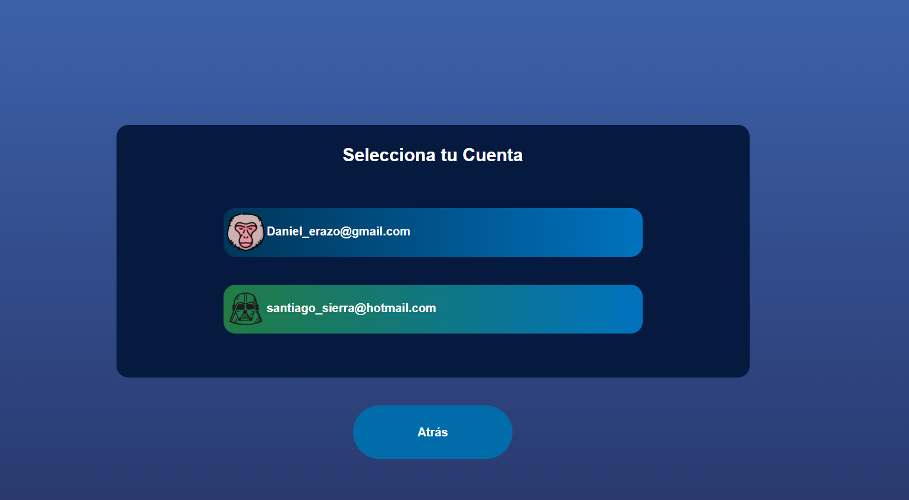
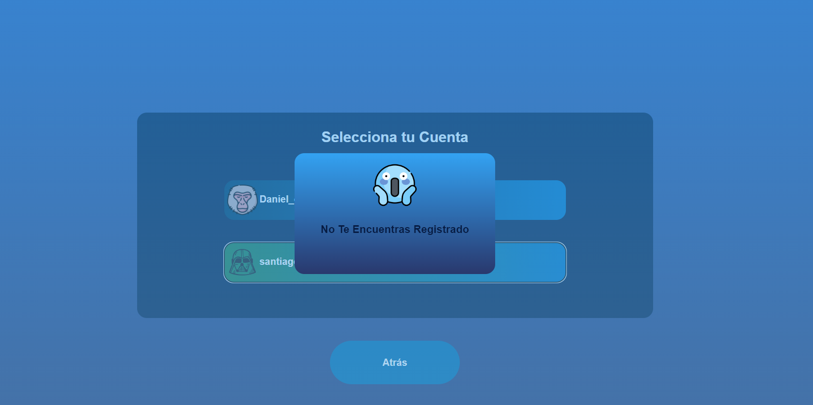
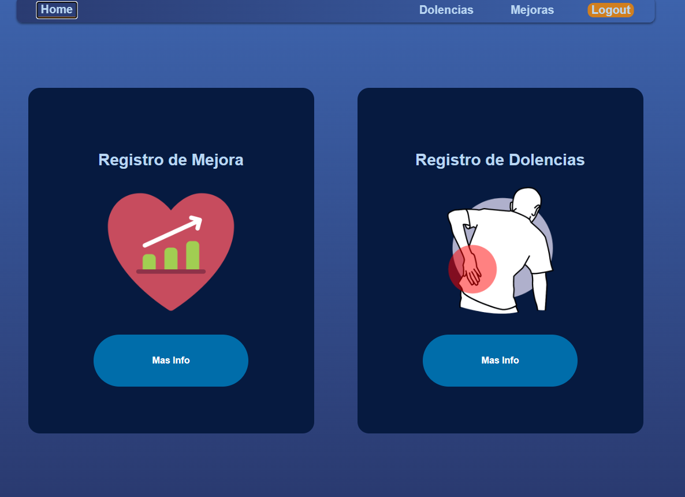
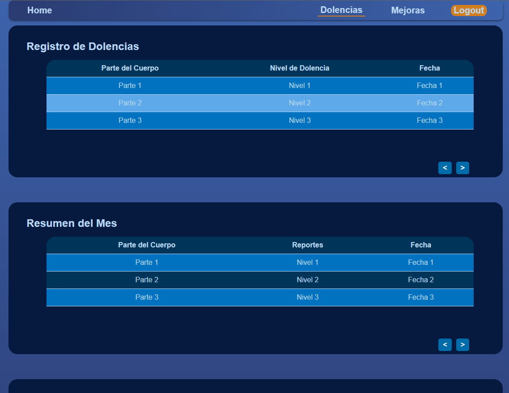

# Despliegue de Aplicación ActiveYa desde GitHub

Este repositorio contiene una aplicación Angular que puede ser desplegada localmente para propósitos de desarrollo o pruebas.

## Requisitos Previos

- Node.js y npm instalados en tu sistema. Puedes descargarlos desde [aquí](https://nodejs.org/).
- Angular CLI instalado de forma global. Puedes instalarlo ejecutando el siguiente comando en tu terminal:

  ```
  npm install -g @angular/cli
  ```

## Pasos para el Despliegue Local

1. **Clona el Repositorio:**
   
   ```
   git clone https://github.com/SSierra1701/ux_pausas_activas_web
   ```

2. **Instala las Dependencias:**

   Navega al directorio de la aplicación clonada (ux_pausas_activas_web) verifica que te encuentres en la rama 'master' y ejecuta el siguiente comando para instalar todas las dependencias necesarias:

   ```
   cd ux_pausas_activas_web
   npm install
   ```

3. **Inicia el Servidor de Desarrollo:**

   Una vez que todas las dependencias estén instaladas, puedes iniciar el servidor de desarrollo ejecutando:

   ```
   ng serve --o
   ```

   Esto iniciará el servidor de desarrollo y tu aplicación estará disponible en `http://localhost:4200/`. La aplicación se recargará automáticamente si realizas cambios en los archivos fuente.

## Imagenes de referencia del contenido:




